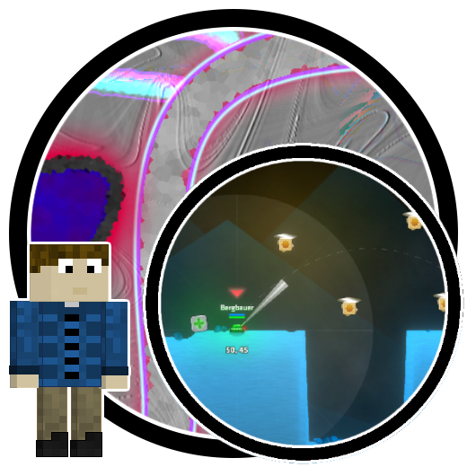

<h1 align="center">BergsMapPack</h1>

# General
This mod introduces two new maps with unique features. I want that all of this Maps are beatable in every difficult without any other mods and that every map have something special.
<h1 aling="left"></h1>

# Moonway
The first map, 'Moonway,' is an advanced map where you can see sometimes a kind of rocket. 

# ShellShock
The second map, an expert one named 'Shellshock,' allows you to pop Bloons with a simple left click on your mouse. Additionally, you gain +1 damage for every $5,000 (in sale value) by your military monkeys, and your pierce is tripled for each Churchill present on the map   

Credits to Timotheeee for his MapEditor

